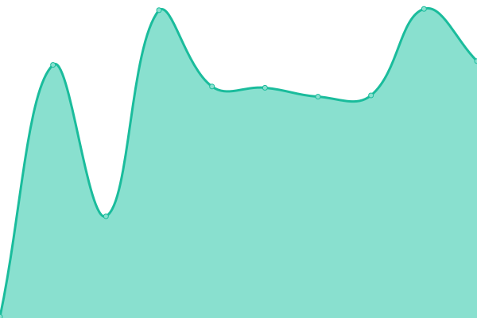
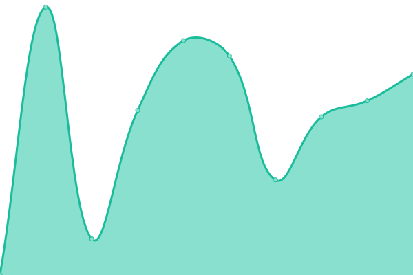

# [📈 Live Status](https://status.arcafin.fr): <!--live status--> **🟩 All systems operational**

This repository contains the open-source uptime monitor and status page for [ARCA Systems](https://arcafin.fr)

<!--start: status pages-->
<!-- This summary is generated by Upptime (https://github.com/upptime/upptime) -->
<!-- Do not edit this manually, your changes will be overwritten -->
<!-- prettier-ignore -->
| URL | Status | History | Response Time | Uptime |
| --- | ------ | ------- | ------------- | ------ |
|  [Arca Home](https://arcafin.fr) | 🟩 Up | [arca-home.yml](https://github.com/ItsNewe/arca-monitor/commits/HEAD/history/arca-home.yml) | 

 478ms
     
 | 

<a href="https://status.arcafin.fr/history/arca-home">100.00%</a>
    

|  [Lighthouse](https://arcafin.fr/lighthouse) | 🟩 Up | [lighthouse.yml](https://github.com/ItsNewe/arca-monitor/commits/HEAD/history/lighthouse.yml) | 

 268ms
     
 | 

<a href="https://status.arcafin.fr/history/lighthouse">99.19%</a>
    

|  [Hermès](https://mx.arcafin.fr) | 🟩 Up | [hermes.yml](https://github.com/ItsNewe/arca-monitor/commits/HEAD/history/hermes.yml) | 

 794ms
     
 | 

<a href="https://status.arcafin.fr/history/hermes">100.00%</a>
    

|  [Shlink](https://s.arcafin.fr/rest/v3/health) | 🟩 Up | [shlink.yml](https://github.com/ItsNewe/arca-monitor/commits/HEAD/history/shlink.yml) | 

 460ms
     
 | 

<a href="https://status.arcafin.fr/history/shlink">100.00%</a>
    

<!--end: status pages-->

[**Status website →**](https://status.arcafin.fr)

## 📄 License

- Powered by: [Upptime](https://github.com/upptime/upptime)
- Code: [MIT](./LICENSE) © [Anand Chowdhary](https://anandchowdhary.com), supported by [Pabio](https://pabio.com)
- Data in the `./history` directory: [Open Database License](https://opendatacommons.org/licenses/odbl/1-0/)
